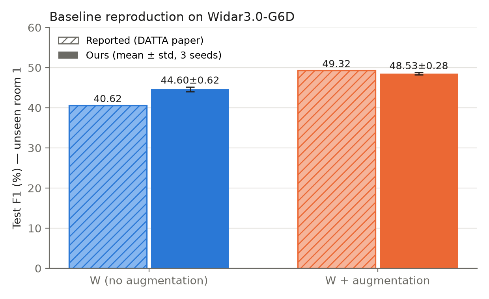
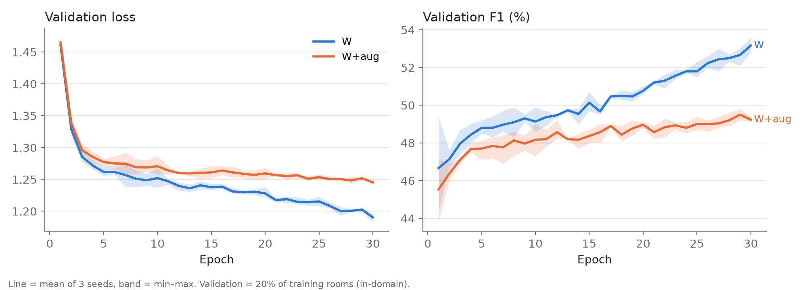
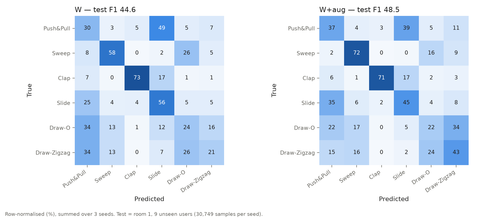

# Results: Baseline reproduction (WiFlexFormer on Widar3.0-G6D)

## Setup
- Script: `../Code/src/train_eval.py` (DATTA's own model, augmentation, split and F1 definition)
- Hardware: Google Colab, NVIDIA Tesla T4
- Train/Val: rooms 2 and 3 (7 domains), random 80/20 split, seed 42 → 19,586 train / 4,896 val
- Test: room 1 (9 unseen users), 90% of the shuffled TEST split → 30,749 samples (the other 10% is reserved for DATTA's Val_TTA)
- Model selection: checkpoint with the lowest validation loss
- Hyperparameters (same as the paper): batch size 8, AdamW, lr 5e-5, weight decay 1e-3, cosine warm restarts, grad clip 1.0
- Budget: 30 epochs per run (the paper allows up to 4000), 3 seeds per configuration
- Model size: 42.0K parameters

## Reported vs obtained (test F1, %)

| Config | Reported (DATTA paper) | Ours (mean ± std, 3 seeds) | Difference |
|---|---|---|---|
| W (no augmentation) | 40.62 | **44.60 ± 0.62** | +3.98 |
| W + augmentation | 49.32 | **48.53 ± 0.28** | −0.79 |

## All metrics (mean ± std over seeds 1, 2, 3)

| Config | Accuracy | Precision | Recall | F1 | Inference (ms/sample, T4) |
|---|---|---|---|---|---|
| W | 41.47 ± 0.22 | 45.36 ± 1.06 | 43.87 ± 0.24 | 44.60 ± 0.62 | 0.26 |
| W + aug | 45.93 ± 0.29 | 48.76 ± 0.27 | 48.30 ± 0.31 | 48.53 ± 0.28 | 0.26 |

Per-seed numbers: `per_run_results.csv`. Summary: `summary.csv`. Everything in one file: `all_results.json`.

## Observations
1. **W+aug reproduces the paper closely** (48.53 vs 49.32, within 0.8 F1) even with only 30 epochs.
2. **Plain W scores higher than reported** (44.60 vs 40.62). Its validation loss was still falling at epoch 30 (best epoch = 30 for every seed), so our W is effectively early-stopped. A model trained much longer on rooms 2–3 is likely to fit them more tightly and transfer worse to room 1, which would explain the paper's lower number.
3. **Augmentation narrows the domain gap.** W reaches ~53 F1 on in-domain validation but 44.6 on the unseen room (gap ≈ 8.5). W+aug reaches ~49 on validation and 48.5 on the unseen room (gap < 1). Augmentation lowers in-domain fit but improves cross-domain transfer by +3.9 F1.
4. **Per-class behaviour** (row-normalised confusion matrices below): Clap and Sweep are recognised best; Push&Pull is often confused with Slide, and Draw-O with Draw-Zigzag (similar motion patterns). Augmentation helps Draw-Zigzag (+22.3 recall), Sweep (+13.2) and Push&Pull (+7.2), but hurts Slide (−11.3). See `per_class_recall.csv`.
5. Runs are stable across seeds (std ≤ 0.62 F1), and the model is very light: 42K parameters, ~0.26 ms per sample on a T4.

## Deviations from the paper
- 30 epochs instead of up to 4000 (free Colab GPU limits).
- Dataset built with a low-memory version of DATTA's preprocessing script (same output: 24,482 train / 34,166 test samples).
- csiread 1.4.1 instead of 1.4.0, and current PyTorch on Colab instead of 2.3.0.

Checkpoints (`*.pt`) are kept on the team Google Drive and are not committed.
